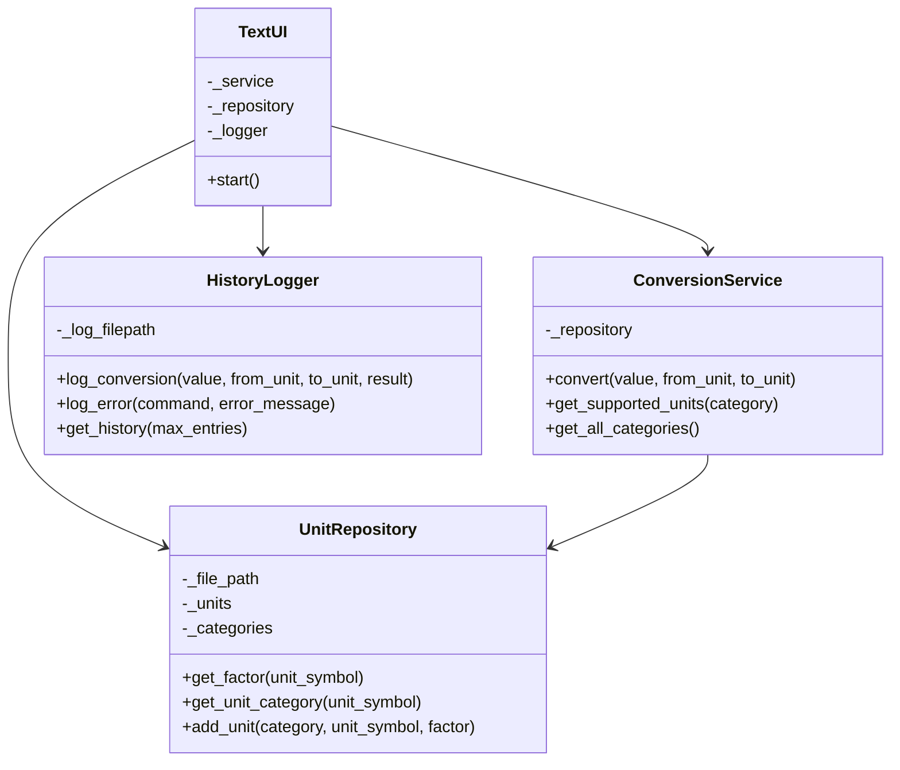
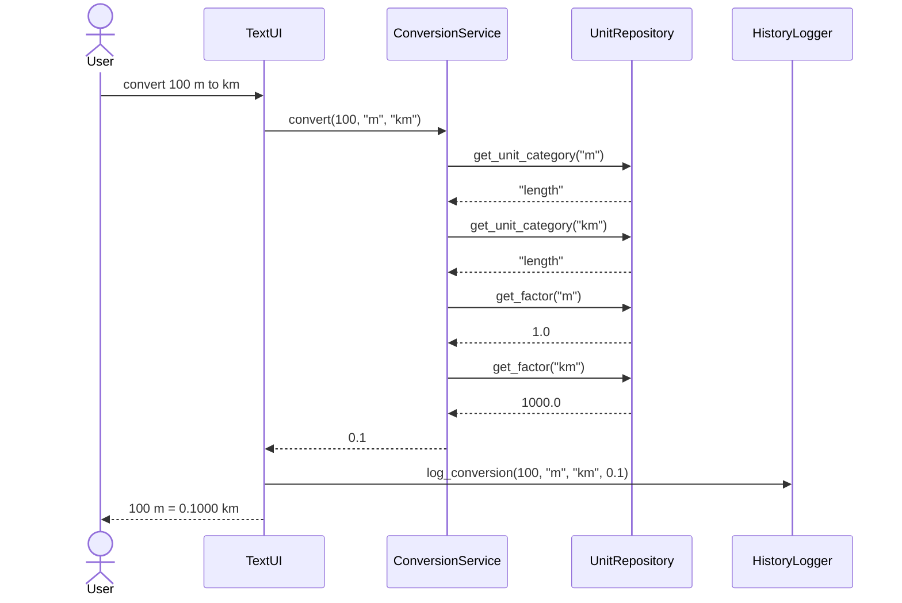
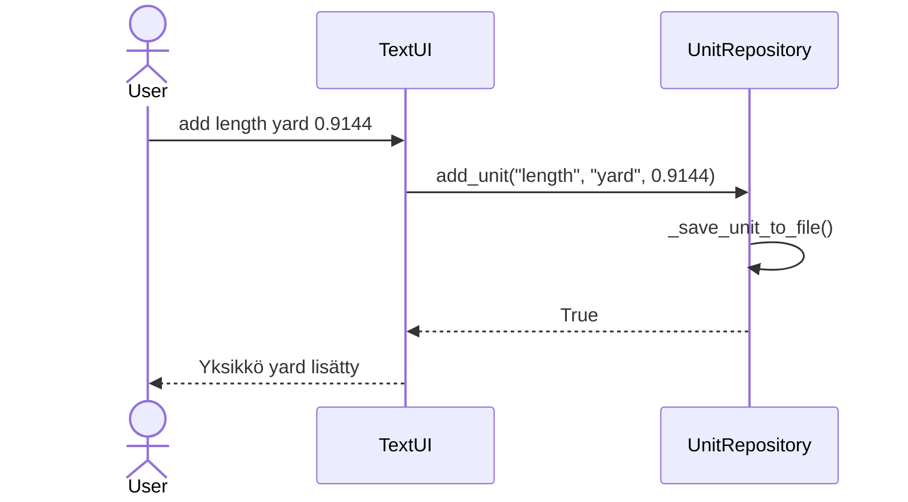

# Arkkitehtuurikuvaus

## Rakenne

Ohjelman rakenne noudattaa kolmitasoista kerrosarkkitehtuuria, ja koodin pakkausrakenne on seuraava:

```
src/
├── ui/
│   └── text_ui.py
├── services/
│   ├── conversion_service.py
│   └── history_logger.py
├── repositories/
│   └── unit_repository.py
├── main.py
└── index.py
```

Pakkaus **ui** sisältää käyttöliittymästä vastaavan koodin. Pakkaus **services** sisältää sovelluslogiikasta vastaavan koodin, mukaan lukien yksikkömuunnokset ja lokitiedoston hallinnan. Pakkaus **repositories** sisältää tietojen pysyväistallennuksesta vastaavan koodin.

## Käyttöliittymä

Sovelluksessa on tekstipohjainen käyttöliittymä, joka on toteutettu [TextUI](../yksikkomuunnin/src/ui/text_ui.py)-luokassa. Käyttöliittymä tarjoaa seuraavat komennot:

- `convert [arvo] [yksikkö] to [yksikkö]` - Yksikkömuunnos
- `list [kategoria]` - Tuettujen yksiköiden listaus
- `add [kategoria]:[yksikkö];[kerroin]` - Uuden yksikön lisäys
- `exit` - Ohjelman lopetus

Käyttöliittymä on eristetty sovelluslogiikasta. Se kutsuu ainoastaan [ConversionService](../yksikkomuunnin/src/services/conversion_service.py)- ja [UnitRepository](../yksikkomuunnin/src/repositories/unit_repository.py)-luokkien metodeja.

## Sovelluslogiikka

Sovelluksen loogisen tietomallin muodostavat yksikkökategoriat (length, mass, temp, time) ja niiden muuntokertoimet. Toiminnallisista kokonaisuuksista vastaa [ConversionService](../yksikkomuunnin/src/services/conversion_service.py)-luokka.

Luokka tarjoaa käyttöliittymälle seuraavat metodit:

- `convert(value, from_unit, to_unit)` - Muuntaa arvon yksiköstä toiseen
- `get_supported_units(category)` - Palauttaa tuetut yksiköt
- `get_all_categories()` - Palauttaa kaikki kategoriat

Lisäksi [HistoryLogger](../yksikkomuunnin/src/services/history_logger.py)-luokka vastaa muunnosten ja virheiden lokittamisesta tiedostoon.

### Luokkakaavio



## Tietojen pysyväistallennus

Pakkauksen **repositories** luokka [UnitRepository](../yksikkomuunnin/src/repositories/unit_repository.py) huolehtii yksikkötietojen lukemisesta ja tallettamisesta. Tiedot tallennetaan tekstitiedostoon `data/units.txt`.

Lisäksi [HistoryLogger](../yksikkomuunnin/src/services/history_logger.py) tallentaa muunnoshistorian ja virheelliset syötteet tiedostoon `data/history.log`.

### Tiedostot

Sovellus käyttää seuraavia datatiedostoja:

**units.txt** - Yksiköt ja muuntokertoimet seuraavassa formaatissa:
```
length:m;1.0
length:km;1000.0
length:cm;0.01
mass:g;1.0
mass:kg;1000.0
temp:celsius;0
temp:fahrenheit;1
```

Kentät: `kategoria:yksikkö;kerroin`, eroteltu puolipisteellä.

**history.log** - Muunnoshistoria ja virheet:
```
[2025-12-09 10:30:15] CONVERSION: 100 m -> 0.1000 km
[2025-12-09 10:31:02] ERROR: 'convert abc m to ft' - could not convert string to float
```

## Päätoiminnallisuudet

### Yksikkömuunnos

Kun käyttäjä syöttää komennon `convert 100 m to km`, etenee sovelluksen kontrolli seuraavasti:



### Uuden yksikön lisääminen

Kun käyttäjä syöttää komennon `add length:yard;0.9144`:



## Ohjelman rakenteeseen jääneet heikkoudet

### Käyttöliittymä

Tekstipohjainen käyttöliittymä voisi hyödyntää enemmän luokkia eri komentojen käsittelyyn. Nykyinen toteutus sisältää kaikki komennot samassa luokassa.

### Tietojen tallennus

Yksikkötiedot tallennetaan yksinkertaiseen tekstitiedostoon. Monimutkaisemmissa sovelluksissa voitaisiin käyttää tietokantaa tai JSON-formaattia.