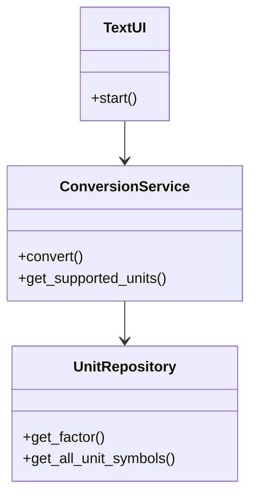

# Arkkitehtuurikuvaus

## Luokkakaavio



Sovelluksen keskeiset luokat:
- **ConversionService**: Yksikkömuunnosten sovelluslogiikka
- **UnitRepository**: Yksikkötietojen hallinta
- **TextUI**: Käyttöliittymä

## Tietojen pysyväistallennus

Pakkauksen repositories luokka UnitRepository huolehtii yksikkötietojen lataamisesta. Luokka lukee yksikkötiedot tekstitiedostosta `data/units.txt`.

Yksikkötiedot tallennetaan seuraavassa muodossa:
```
kategoria:yksikkö;muuntokerroin
```

Esimerkiksi:
```
length:m;1.0
length:ft;0.3048
mass:kg;1.0
mass:lb;0.453592
temp:celsius;0
temp:fahrenheit;1
temp:kelvin;2
```

## Päätoiminnallisuudet

Kuvaamme seuraavaksi sovelluksen toimintalogiikkaa muutaman päätoiminnallisuuden osalta.

### Yksikkömuunnos

Kun käyttäjä syöttää komennon `convert 10 m to ft`, etenee sovelluksen kontrolli seuraavasti:

1. TextUI vastaanottaa syötteen ja parsii sen osiin
2. TextUI kutsuu ConversionService.convert(10, "m", "ft")
3. ConversionService tarkistaa UnitRepository:sta että molemmat yksiköt kuuluvat samaan kategoriaan
4. ConversionService hakee molempien yksiköiden muuntokertoimet UnitRepository:sta
5. ConversionService laskee muunnoksen perusyksikön kautta ja palauttaa tuloksen
6. TextUI näyttää tuloksen käyttäjälle

### Yksikköjen listaus

Kun käyttäjä syöttää komennon `list mass`, toimii sovellus seuraavasti:

1. TextUI tunnistaa list-komennon ja kutsuu handle_list_command-metodia
2. TextUI kutsuu ConversionService.get_supported_units("mass")
3. ConversionService pyytää UnitRepository:lta kyseisen kategorian yksiköt
4. UnitRepository palauttaa massakategorian yksiköt
5. TextUI näyttää yksiköt käyttäjälle