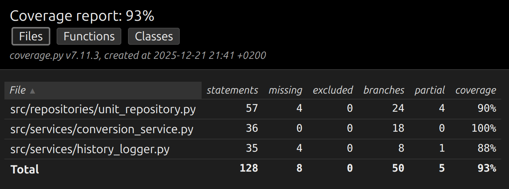

# Testausdokumentti

Ohjelmaa on testattu sekä automatisoiduin yksikkö- ja integraatiotestein unittestilla sekä manuaalisesti tapahtunein järjestelmätason testein.

## Yksikkö- ja integraatiotestaus

### Sovelluslogiikka

Sovelluslogiikasta vastaavaa `ConversionService`-luokkaa testataan [TestConversionService](https://github.com/4smo/ot-harjoitustyo/blob/main/yksikkomuunnin/src/tests/test_conversion_service.py)-testiluokalla. `ConversionService`-olio alustetaan niin, että sille injektoidaan riippuvuudeksi `FakeRepository`-olio, joka tallentaa tietoa muistiin pysyväistallennuksen sijaan. Tämä mahdollistaa testien suorittamisen ilman oikeaa tiedostojärjestelmää.

### Repositorio-luokat

`UnitRepository`-luokkaa testataan [TestUnitRepository](https://github.com/4smo/ot-harjoitustyo/blob/main/yksikkomuunnin/src/tests/test_unit_repository.py)-testiluokalla. Testeissä käytetään sekä oikeaa `units.txt`-tiedostoa että väliaikaisia testitiedostoja, jotka luodaan Pythonin `tempfile`-moduulilla. Väliaikaistiedostoja käytetään erityisesti yksikköjen lisäämisen testaamisessa.

`HistoryLogger`-luokkaa testataan [TestHistoryLogger](https://github.com/4smo/ot-harjoitustyo/blob/main/yksikkomuunnin/src/tests/test_history_logger.py)-testiluokalla. Testit käyttävät väliaikaista hakemistoa ja lokitiedostoa, jotka siivotaan automaattisesti testien jälkeen.

### Testauskattavuus

Käyttöliittymäkerrosta lukuunottamatta sovelluksen testauksen haarautumakattavuus on 93%

Testaamatta jäivät _main.py_- ja _index.py_-tiedostojen suorittaminen komentoriviltä sekä käyttöliittymäluokka `TextUI`. Lisäksi testaamatta jäivät joitakin harvemmin käytettyjä virhetilanteita repositorio-luokissa.

## Järjestelmätestaus

Sovelluksen järjestelmätestaus on suoritettu manuaalisesti.

### Asennus ja konfigurointi

Sovellus on haettu ja sitä on testattu [README](../yksikkomuunnin/README.md)-tiedoston kuvaamalla tavalla Linux-ympäristössä. Sovellusta on testattu sekä tilanteissa, joissa datatiedostot (`units.txt`, `history.log`) ovat olleet olemassa ja joissa niitä ei ole ollut.

### Toiminnallisuudet

Kaikki [vaatimusmäärittelyn](./vaatimusmaarittely.md) listaamat toiminnallisuudet on käyty läpi:

- Yksikkömuunnokset kaikissa kategorioissa (pituus, massa, lämpötila, aika)
- Tuettujen yksiköiden listaus (`list` ja `list [kategoria]`)
- Uusien yksiköiden lisääminen (`add`)
- Virheellisten syötteiden käsittely

Kaikkien toiminnallisuuksien yhteydessä on syötekentät yritetty täyttää myös virheellisillä arvoilla, kuten:
- Tuntemattomat yksiköt
- Eri kategorioiden yksiköiden muuntaminen keskenään
- Virheelliset komennot
- Tyhjät syötteet

## Sovellukseen jääneet laatuongelmat

Sovellus ei anna tällä hetkellä järkeviä virheilmoituksia seuraavissa tilanteissa:

- Konfiguraation määrittelemiin tiedostoihin ei ole luku/kirjoitusoikeuksia
- Datatiedostot (`units.txt`) ovat korruptoituneet tai virheellisessä muodossa
