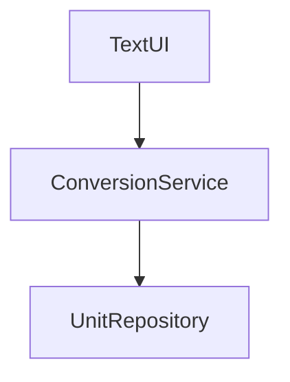

# Arkkitehtuurikuvaus

## Luokkakaavio

Sovelluksen keskeiset luokat:
- **TextUI**: Käyttöliittymä
- **ConversionService**: Yksikkömuunnosten sovelluslogiikka
- **UnitRepository**: Yksikkötietojen hallinta